# Orbit

> 🔎 **Live demo (read-only):** [orbit-demo.withtahmid.com](https://orbit-demo.withtahmid.com)
> — sign in as `alex@orbit.dev` / `password123` to explore a fully seeded
> sandbox. Mutations are rejected at both the tRPC layer and the Postgres
> session, so state is stable across visitors.
>
> **Production:** [orbit.withtahmid.com](https://orbit.withtahmid.com) ·
> **Docs:** [orbit.withtahmid.com/docs](https://orbit.withtahmid.com/docs)

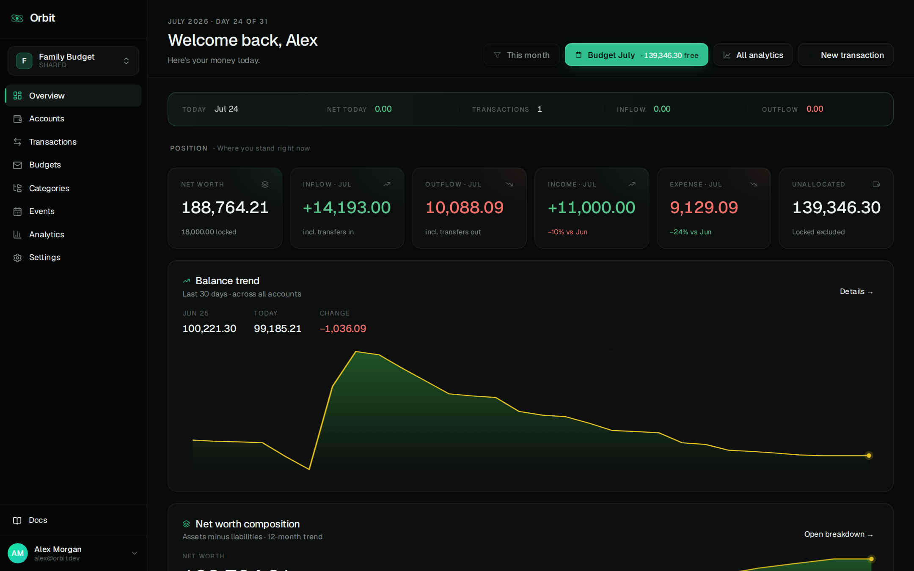

A collaborative personal-finance app for small groups — families, couples,
roommates, shared projects. Orbit combines three orthogonal models into a
single coherent ledger:

- **Ledger accounting** — accounts hold real money, transactions move it.
- **Envelope budgeting** — named buckets hold a logical allocation; spending
  routes through categories. Envelopes can carry an optional target amount +
  target date for long-horizon goals (e.g. "save 80K for a down payment by
  next October"), with progress tracked against lifetime funding. Categories
  carry an optional priority tier (essential / important / discretionary /
  luxury) with ancestor inheritance, so analytics can answer "what fraction
  of this month was must-spend vs want-spend?" at a glance — with the
  granularity to mark an occasional premium leaf as luxury while its
  siblings stay essential.

The transaction-entry form is the highest-traffic surface, and ships with
two friction reducers worth calling out: a **custom date+time picker**
with smart relative labels (Now / Today / Yesterday / Mar 5) and full
keyboard navigation in APP-timezone math, and a **pin system** that
remembers your usual Account, Envelope, and Event so the form
pre-hydrates instead of starting empty — per-user for Account,
space-wide for Envelope and Event with an owner/editor permission gate.

Users in multiple shared spaces (roommates, office, family, …) also get a
**virtual "My money" space** at `/s/me` that unions every space they're in,
filtered to accounts they personally own — same overview / transactions /
analytics views as a real space, just anchored on the user instead of a
group. See [project spec §6.5](./contexts/project-specification.md) for the
full semantics.

Design priorities, in order: **correctness → clarity → performance**.

Full product guide (end-user facing): visit
[`/docs`](https://orbit.withtahmid.com/docs) in the running app, or read
[`contexts/project-specification.md`](./contexts/project-specification.md)
for the developer-facing product spec and
[`contexts/engineering-specification.md`](./contexts/engineering-specification.md)
for how it runs in production.

---

## Screenshots

All shots below are the seeded demo dataset (`pnpm --filter backend seed`) —
the same data the [live demo](https://orbit-demo.withtahmid.com) runs on.
More context for every screen is in the in-app [`/docs`](https://orbit.withtahmid.com/docs) guide.

|                                                                           |                                                                                           |
| ------------------------------------------------------------------------- | ----------------------------------------------------------------------------------------- |
| **Budgets** — envelope gauges with cadence badges and overspend alerts    | **Budget this month** — per-envelope planning with last-month / average / quick-set chips |
| 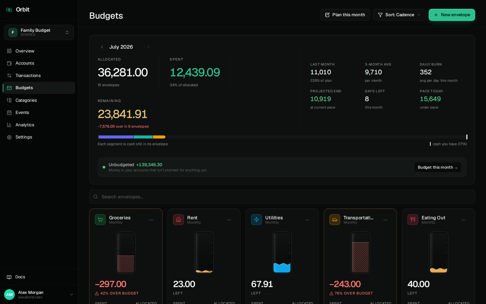                            | 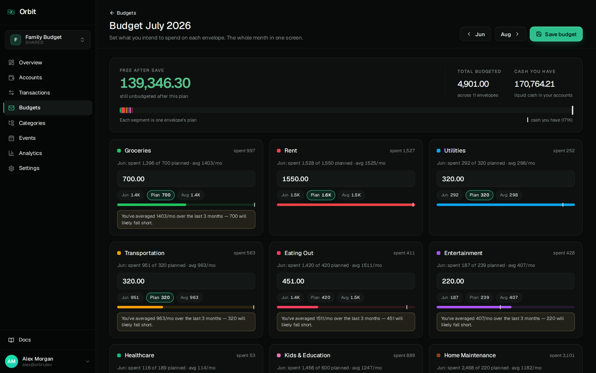                             |
| **Transactions** — filters, envelope/category chips, balance-after column | **Transaction detail** — full details with attachments                                    |
| 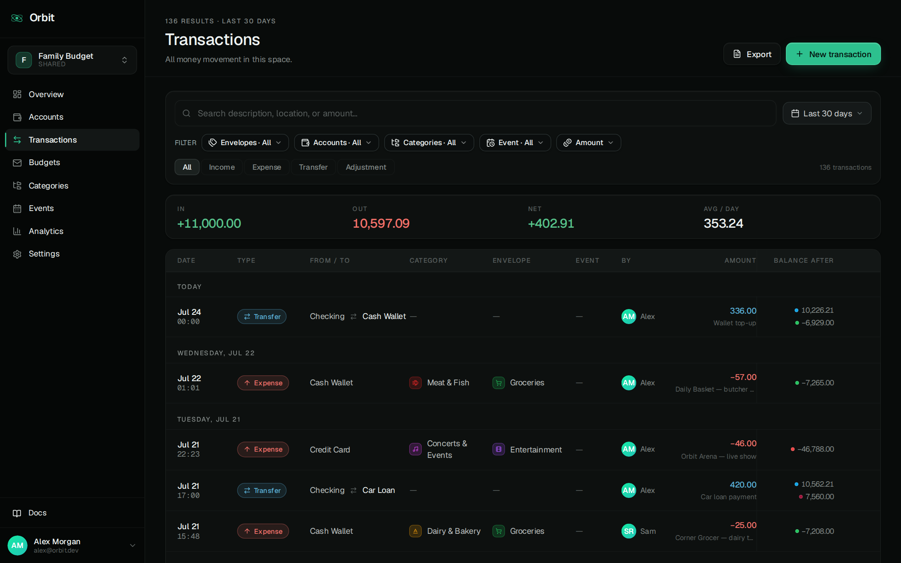                  | 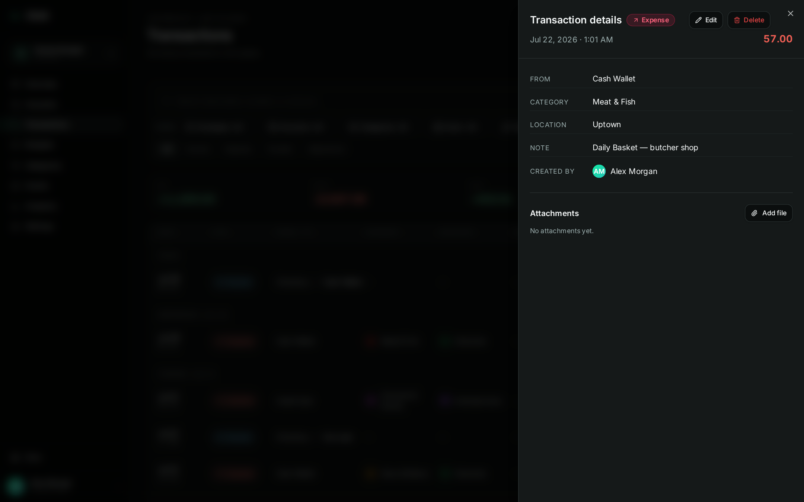                 |
| **Analytics** — eight drillable views, each with its own period selector  | **Spending calendar** — twelve months shaded by intensity, recurring-bill markers         |
| 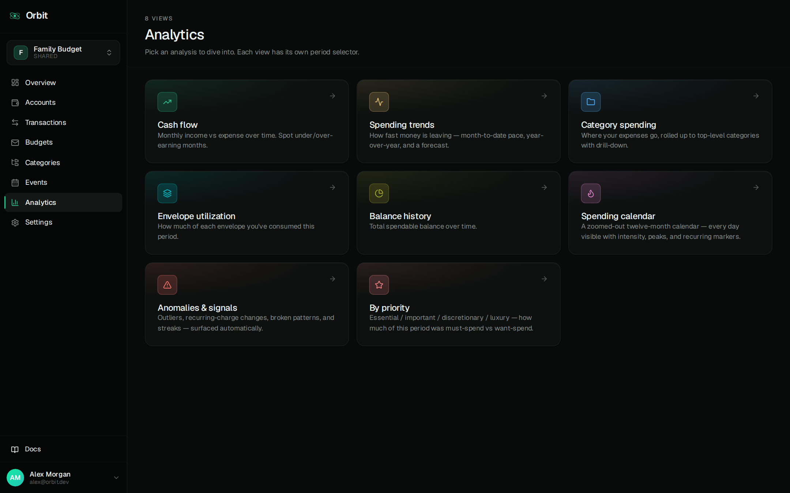                  | 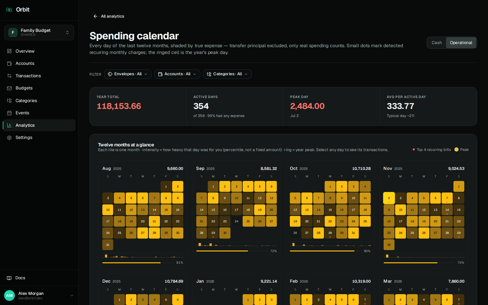                        |
| **Spending trends** — pace, projection, and cumulative spend race         | **Categories** — drag-to-re-nest workbench with priority tiers                            |
| 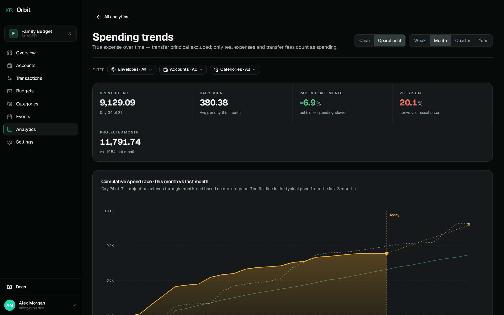           | 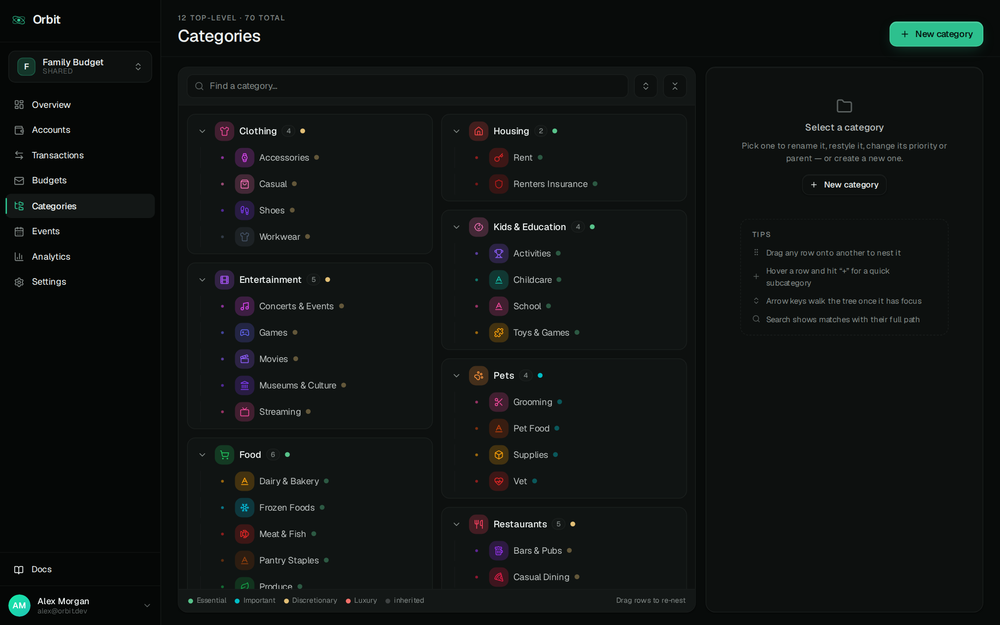                            |
| **Events** — year timeline with estimate progress                         | **Event detail** — budget gauge, category donut, spending timeline                        |
| 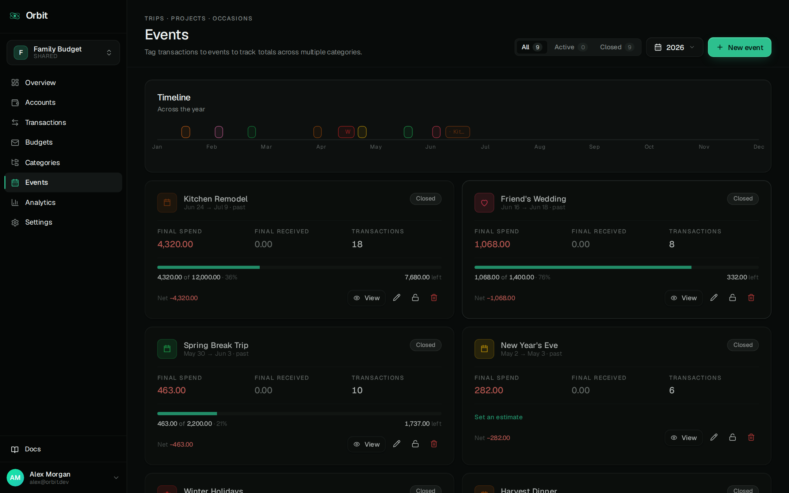                              | 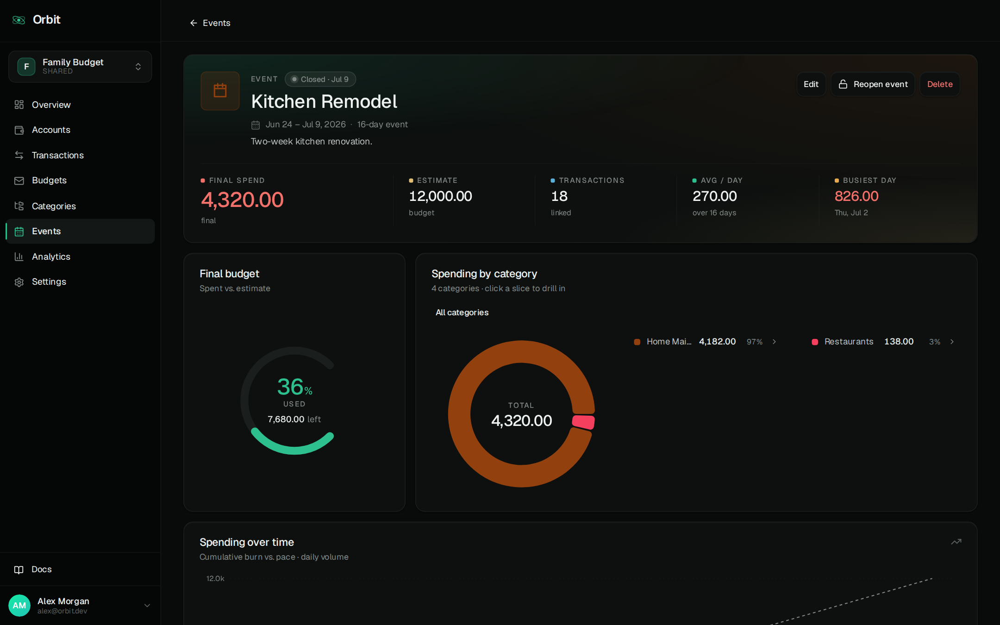                                  |
| **My money** — every space you're in, unioned into one personal view      | **Space settings** — members, roles, invite-by-email                                      |
| 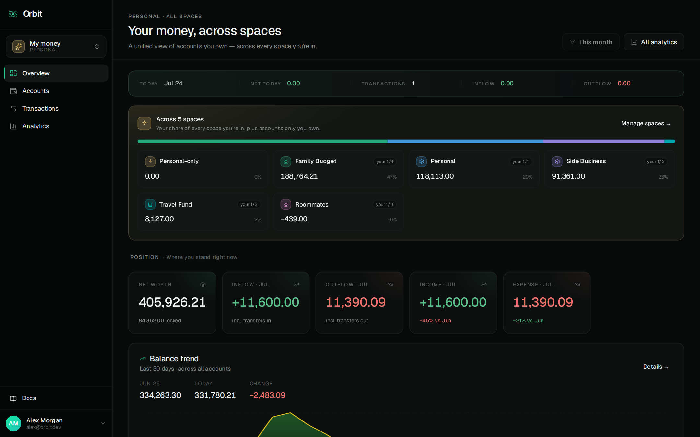                          | 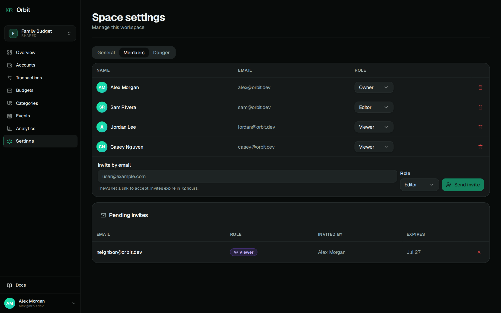                              |

---

## Stack

Turborepo + pnpm workspace. Two apps, one database, one object store.

|                 |                                                                                                             |
| --------------- | ----------------------------------------------------------------------------------------------------------- |
| Backend         | Node.js + Express + [tRPC v11](https://trpc.io), ESM-only (`.mts` → `.mjs`)                                 |
| Database        | Postgres 18 via `pg.Pool` + [Kysely](https://kysely.dev) query builder; types generated by `kysely-codegen` |
| Object storage  | Cloudflare R2 via `@aws-sdk/client-s3` + presigned URLs (avatars, attachments, exported reports)            |
| Image pipeline  | `sharp` — avatar resize to 256 px + 64 px webp variants                                                     |
| Email           | `nodemailer` + React 19 JSX templates rendered server-side via `ReactDOMServer`                             |
| Frontend        | Vite + React 19 + React Router v7 + TanStack Query + `@trpc/react-query`                                    |
| Auth state      | MobX (`AuthStore`, `SignupStore`, `ForgotPasswordStore`)                                                    |
| Styling         | Tailwind v4, shadcn/ui primitives, dark-only emerald/teal theme                                             |
| Charts          | Recharts                                                                                                    |
| Mail (dev)      | MailDev on `:1025` / UI on `:1080`                                                                          |
| Analytics (dev) | Metabase on `:3001`                                                                                         |

Web app talks to the backend over tRPC with end-to-end types — the client
imports `AppRouter` straight from the backend source. No codegen step.

### Production hosting

| Surface | Host                                                                     |
| ------- | ------------------------------------------------------------------------ |
| Web     | Cloudflare Pages — [orbit.withtahmid.com](https://orbit.withtahmid.com)  |
| API     | Vercel serverless (`apps/server` as the default export from `index.mts`) |
| DB      | Managed Postgres 18                                                      |
| Files   | Cloudflare R2 bucket                                                     |

CI/CD is two GitHub Actions workflows in `.github/workflows/`
(`deploy-server.yml`, `deploy-web.yml`), triggered on `main` pushes that
touch their respective app paths. DB migrations are **not** part of
deploy — run them manually with `pnpm --filter backend migrate` against
the target `DATABASE_URL`.

---

## Repository layout

```
apps/
├── server/                       # tRPC backend
│   └── src/
│       ├── db/kysely/
│       │   ├── migrations/       # schema history (0001–0050), applied with `pnpm migrate`
│       │   └── types.mts         # generated — don't hand-edit
│       ├── procedures/           # one procedure per file per resource
│       ├── routers/              # feature routers composing procedures
│       ├── trpc/                 # context, middlewares
│       ├── services/             # pg pool, mailer, R2 client
│       │   ├── mail/             # nodemailer + JSX email templates
│       │   └── r2/               # S3-compatible R2 client + presigner
│       └── env.mts               # typed env parsing
└── web/                          # Vite + React frontend
    └── src/
        ├── pages/                # route-level screens (incl. public DocsPage)
        ├── features/             # composed multi-component flows
        ├── components/ui/        # shadcn primitives
        ├── components/shared/    # Orbit-specific shared pieces
        ├── layouts/              # Root, Auth, AppShell, SpaceLayout
        ├── router/               # routes + guards
        ├── hooks/                # usePeriod, useCurrentSpace, useFileUpload, useSignedUrl, ...
        ├── lib/                  # dates, money, entityStyle, formatDate, ...
        ├── stores/               # MobX
        └── trpc.ts               # cross-app type import → `AppRouter`

contexts/                         # non-code context
├── project-specification.md      # product & domain source of truth
├── engineering-specification.md  # how Orbit runs in production
└── modules/                      # per-module deep dives (server / web / shared)
packages/                         # workspace stubs (eslint, tsconfig, ui)
.github/workflows/                # deploy-server.yml, deploy-web.yml
docker-compose.yml                # orbit + db + maildev + metabase
```

---

## Quick start

The recommended dev environment is `docker-compose` — it brings up the app,
Postgres, MailDev, and Metabase in one go.

```bash
# 1. Copy the example env
cp .env.local.example .env.local          # edit as needed

# 2. Boot the stack
docker-compose up --build

# 3. (first run, in a separate terminal) apply DB migrations
docker-compose exec orbit pnpm --filter backend migrate
```

Then:

- Web app → http://localhost:5173
- tRPC endpoint → http://localhost:3000/trpc
- tRPC Playground (dev only) → http://localhost:3000/trpc-playground
- MailDev UI → http://localhost:1080
- Metabase → http://localhost:3001

Log in / sign up, create a space, add an account, record a transaction.

### Demo data for a fresh DB

Want a rich, screenshot-ready dataset without clicking through the UI?

```bash
pnpm --filter backend seed
```

Wipes every product table and populates 8 users, 5 spaces, 16 accounts,
39 envelopes (a few with goal targets, one archived), ~150 categories,
24 events, ~4,000 transactions spread across ~18 months — with
intentional drift and rebalances to show off the 2D allocation idea —
plus three transaction-entry pins (an account pin for Alex and a
space-wide envelope pin on the family space, a space-wide event pin on
the travel space) so the new-transaction form's "pinned" affordance is
visible out of the box. Data is locale-neutral and currency-agnostic (interpret amounts as
whatever unit you like). Refuses to run when `NODE_ENV=production`.
Primary login is printed at the end: `alex@orbit.dev` / `password123`.

### Without Docker

You'll need Node ≥20, pnpm ≥9, and a local Postgres 18 reachable via
`DATABASE_URL`.

```bash
pnpm install
pnpm --filter backend migrate
pnpm dev                                  # turbo → server + web concurrently
```

---

## Common commands

All from the repo root unless noted.

```bash
pnpm dev                                   # turbo: server + web
pnpm build
pnpm check-types
pnpm format                                # prettier on ts/tsx/md

# Server-only (from apps/server/)
pnpm migrate                               # tsx src/db/kysely/migrator.mts
pnpm generate-types                        # kysely-codegen → types.mts
pnpm seed                                  # wipe + reseed local DB with demo data
pnpm build:watch                           # tsc --watch for dev

# Web-only (from apps/web/)
pnpm dev                                   # vite on :5173
pnpm build                                 # tsc -b && vite build
pnpm lint                                  # eslint .
```

After any schema change, re-run `pnpm --filter backend generate-types` so
the Kysely `DB` type reflects the new columns.

---

## Conventions (short version)

Full details live in [`CLAUDE.md`](./CLAUDE.md) and the architectural spec
at [`contexts/project-specification.md`](./contexts/project-specification.md).

- **ESM import rule** on the server: imports between `.mts` files use `.mjs`
  extensions at the call site (`import { router } from "../trpc/index.mjs"`).
  TypeScript resolves; the ESM runtime needs the `.mjs`.
- **One procedure per file** under `apps/server/src/procedures/<resource>/<action>.mts`.
  Feature routers just re-export.
- **Mutations** run in a `trx.transaction().execute(...)` wrapped in
  `safeAwait`. Re-throw `TRPCError` as-is; wrap other errors as
  `INTERNAL_SERVER_ERROR`.
- **Web**: path alias `@/*` → `apps/web/src/*`. Never hardcode routes —
  use `ROUTES.*(...)` from [`router/routes.ts`](./apps/web/src/router/routes.ts).
- **Money display**: always `<MoneyDisplay amount={…} />`. Never raw-print
  a number as money.
- **Dates from tRPC**: rehydrate with `new Date(resp.field)` before
  `date-fns`. For display, use `formatInAppTz(...)` from
  [`lib/formatDate.ts`](./apps/web/src/lib/formatDate.ts) so everything
  reads in the app timezone regardless of the browser's tz.
- **App timezone**: currently `Asia/Dhaka` (UTC+06:00, no DST). Set via the
  `APP_TIMEZONE` env on the server and a matching constant on the client.
  Per-space override is roadmap.
- **Prettier**: 4-space indent, double quotes, semicolons, 100-char print
  width, `trailingComma: "es5"`. Run `pnpm format` before larger commits.
- **Commit style**: short imperative prefix — `FEAT:`, `FIX:`, `REFACTOR:`.

---

## Environment

Parsed via `@withtahmid/safenv` in
[`apps/server/src/env.mts`](./apps/server/src/env.mts). The full list with
defaults is the source of truth; the common ones:

| Var                                                                 | Default                  | What it does                                    |
| ------------------------------------------------------------------- | ------------------------ | ----------------------------------------------- |
| `PORT`                                                              | `3000`                   | tRPC/HTTP port (ignored on Vercel)              |
| `DATABASE_URL`                                                      | (docker-compose default) | Postgres connection string                      |
| `NODE_ENV`                                                          | —                        | `development` enables the tRPC Playground       |
| `JWT_SECRET`                                                        | dev fallback             | **Change in production.**                       |
| `APP_TIMEZONE`                                                      | `Asia/Dhaka`             | App-wide IANA zone. `SET` per Postgres session. |
| `SMTP_HOST` / `SMTP_PORT` / `SMTP_USER` / `SMTP_PASS` / `SMTP_FROM` | MailDev                  | Email for signup / reset / welcome              |
| `R2_ACCOUNT_ID`                                                     | `""`                     | Cloudflare R2 account id                        |
| `R2_ACCESS_KEY_ID` / `R2_SECRET_ACCESS_KEY`                         | `""`                     | R2 credentials                                  |
| `R2_BUCKET`                                                         | `""`                     | R2 bucket name                                  |
| `R2_PUBLIC_URL_BASE`                                                | optional                 | Public CDN base (else signed GETs)              |

The `.env.local` at the repo root is what docker-compose loads. The web
app picks up `VITE_BACKEND_URL` at build time (injected as a GitHub
Actions secret in CI).

---

## Documentation

- **End-user guide** → browse to
  [`/docs`](https://orbit.withtahmid.com/docs) in the running web app
  (also reachable from the user-avatar menu and the login page, no
  sign-in required).
- **Product & domain spec** (developer-facing) →
  [`contexts/project-specification.md`](./contexts/project-specification.md) —
  the source of truth for the domain model, invariants, and the 2D
  allocation idea.
- **Engineering spec** (how Orbit runs in prod) →
  [`contexts/engineering-specification.md`](./contexts/engineering-specification.md) —
  deployment topology, request lifecycle, CI/CD, file-upload system,
  operational runbook.
- **Working-with-this-repo notes** → [`CLAUDE.md`](./CLAUDE.md).

---

## Status & roadmap

**Deployed to production** at
[orbit.withtahmid.com](https://orbit.withtahmid.com); feature-complete
for the core ledger / envelope flows and serving real users.
Known limitations worth flagging:

- **Multi-currency** — amounts are currency-agnostic today; a migration
  adding `currency char(3)` on accounts is pending.
- **Per-space timezone** — currently app-wide `Asia/Dhaka`.
- **Weekly / yearly envelope cadence** — schema is ready; the period-math
  helper understands `none | monthly` only.
- **Compounding carry-over** — envelope carry-over looks back exactly one
  period. Multi-month rollover with a recursive CTE is pending.
- **No soft deletes & no audit log** — future work.
- **No automated tests yet** — manual smoke-test checklist in
  [`project-specification.md` §16](./contexts/project-specification.md#16-review--testing-checklist).
- **Orphan `pending` files** in R2 have no GC — a nightly cron is pending.

See [`contexts/project-specification.md` §17](./contexts/project-specification.md#17-known-limitations--deferred)
for the full list, and
[`contexts/engineering-specification.md` §14](./contexts/engineering-specification.md)
for open engineering work.

---

## License

Proprietary — all rights reserved for now. Licensing TBD pre-launch.
